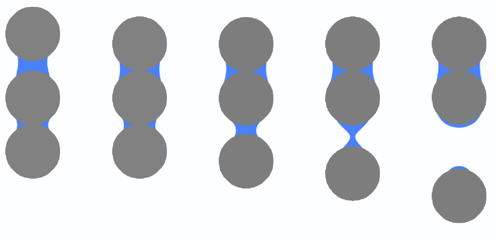

# About ParPhase

LBfoam is an open-source CFD solver based on the lattice Boltzmann method for foaming simulations. The solver is an extended version of the [Palabos](https://palabos.unige.ch/) library.

The paper presenting this work is published in the [Journal of Computer Physics Communications](https://www.sciencedirect.com/science/article/pii/S001046552030343X).

# Highlighted Features

* 2D/3D Free Surface Lattice Boltzmann (FSLBM) solver
* Coupling of the Navier-Stokes equation and advection-dffisuion equation for the simulation bubble growth
* Implementation of bubble interaction using Piecewise Linear Interface Reconstruction (PLIC) and Ray Tracing algorithms
* Nucleating bubbles based on a nucleation probability field using the [Poisson-Disc Sampling](https://en.wikipedia.org/wiki/Poisson_sampling) algorithm
* Fully-parallelized using the [Message Passing Interface (MPI)](https://www.open-mpi.org/) library
